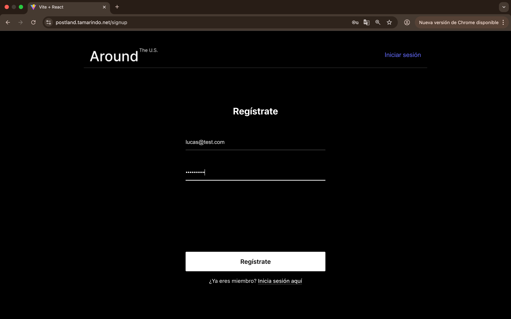
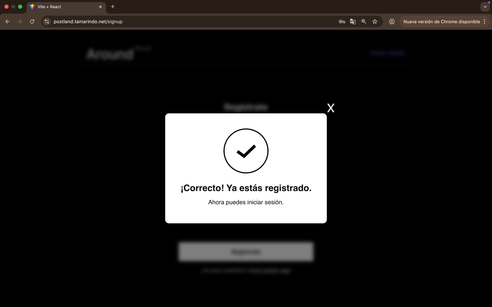
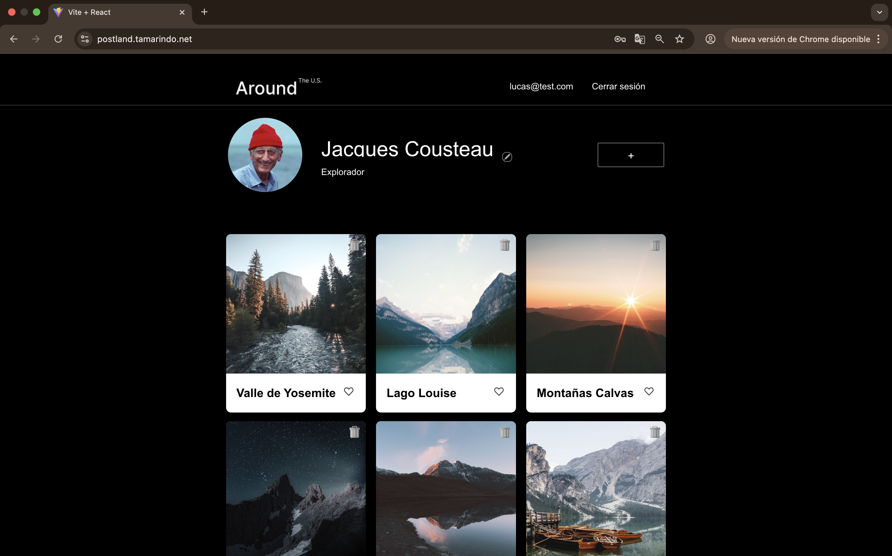
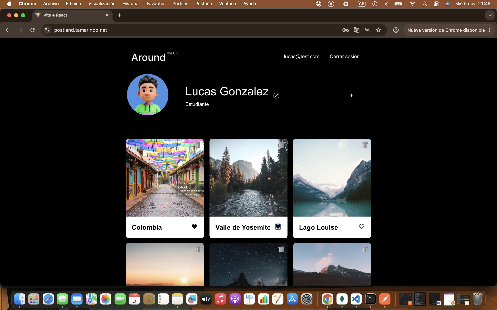
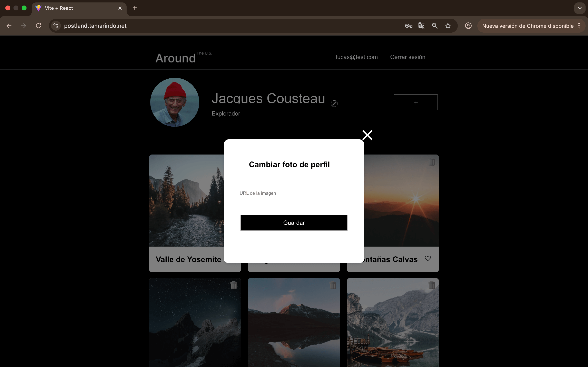
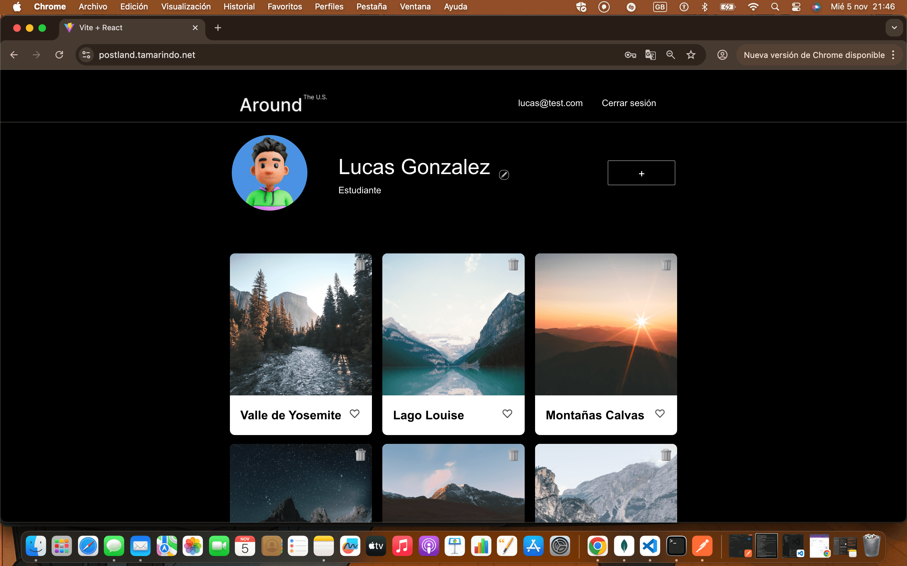
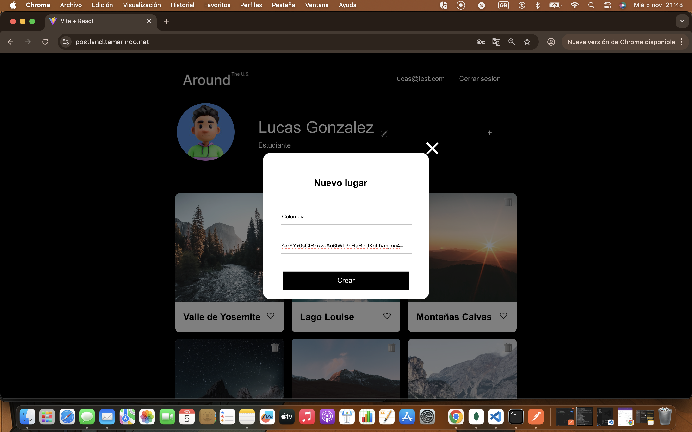

# Postland - Red Social de Lugares 🌎

Aplicación web full-stack que permite a los usuarios compartir lugares favoritos mediante tarjetas con imágenes.

**🔗 URLs del Proyecto:**
- **Frontend:** https://postland.tamarindo.net
- **Backend API:** https://api.postland.tamarindo.net/api

**🌐 Información del Servidor:**
- **Dominio:** postland.tamarindo.net
- **IP del Servidor:** 104.154.131.65
- **Subdominio API:** api.postland.tamarindo.net

---

## 📸 Capturas de Pantalla

### Registro de Usuario



### Galería Principal


### Funcionalidad de Likes


### Edición de Perfil



### Crear Nueva Tarjeta



---

## 📋 Descripción

Postland es una red social donde usuarios registrados pueden:
- ✅ Crear y gestionar su perfil (nombre, descripción, avatar)
- ✅ Publicar tarjetas con imágenes de lugares
- ✅ Dar "like" a tarjetas de otros usuarios
- ✅ Eliminar sus propias tarjetas
- ✅ Ver todas las tarjetas publicadas por la comunidad

---

## 🛠️ Tecnologías Utilizadas

### **Frontend:**
- React 18
- React Router v6
- Vite
- Context API
- Fetch API
- CSS (BEM methodology)

### **Backend:**
- Node.js + Express
- MongoDB + Mongoose
- JWT (jsonwebtoken)
- bcryptjs
- Celebrate + Joi (validación)
- Winston + express-winston (logging)
- CORS

### **Infraestructura:**
- Google Cloud Platform (VM Ubuntu 24)
- Nginx (reverse proxy)
- PM2 (process manager)
- Let's Encrypt (SSL/HTTPS)
- MongoDB Atlas (base de datos en la nube)

---

## ✨ Funcionalidades Principales

### **Autenticación y Usuarios:**
- Registro de nuevos usuarios
- Login con JWT (expiración: 7 días)
- Token almacenado en localStorage
- Auto-login al recargar la página
- Rutas protegidas (solo usuarios autenticados)
- Edición de perfil (nombre, descripción, avatar)

### **Tarjetas:**
- Ver todas las tarjetas de todos los usuarios
- Crear nuevas tarjetas
- Eliminar solo tus propias tarjetas (validado en backend)
- Sistema de likes/dislikes
- Persistencia en MongoDB

### **Seguridad:**
- Contraseñas hasheadas con bcryptjs
- Validación de datos con Celebrate/Joi
- CORS configurado
- Manejo centralizado de errores
- Logging de requests y errores

---

## 📂 Estructura del Proyecto
```
web_project_api_full/
├── backend/
│   ├── controllers/
│   ├── middlewares/
│   ├── models/
│   ├── routes/
│   ├── logs/
│   ├── app.js
│   ├── .env (solo en servidor)
│   └── package.json
├── frontend/
│   ├── src/
│   │   ├── components/
│   │   ├── pages/
│   │   ├── utils/
│   │   └── contexts/
│   ├── dist/ (archivos compilados)
│   └── package.json
├── docs/
│   └── screenshots/
└── README.md
```

---

## 🚀 Instalación y Ejecución Local

### **Requisitos previos:**
- Node.js 18+
- MongoDB (local o Atlas)
- npm

### **Backend:**
```bash
cd backend
npm install
npm run dev
# Servidor en http://localhost:3000
```

### **Frontend:**
```bash
cd frontend
npm install
npm run dev
# App en http://localhost:5173
```

---

## 🌐 Despliegue en Servidor

### **Información del Servidor:**
- **Proveedor:** Google Cloud Platform
- **Sistema Operativo:** Ubuntu 24.04 LTS
- **IP Pública:** 104.154.131.65
- **Dominio Principal:** postland.tamarindo.net
- **Subdominio API:** api.postland.tamarindo.net

### **Acceso al Servidor:**
```bash
ssh linacastror079@104.154.131.65
```

### **Ubicación de Archivos:**
- **Frontend:** `/var/www/postland.tamarindo.net/`
- **Backend:** `/home/linacastror079/web_project_api_full/backend/`

### **Frontend:**
- Compilado con `npm run build`
- Servido por Nginx
- Configuración en `/etc/nginx/sites-available/postland.conf`

### **Backend:**
- Ejecutado con PM2
- Proceso: `backend_api_full`
- Puerto: 3000 (proxy inverso con Nginx)
- Variables de entorno en `.env`:
  - `NODE_ENV=production`
  - `JWT_SECRET=[clave secreta]`
  - `MONGODB_URI=[MongoDB Atlas URI]`

### **SSL/HTTPS:**
- Certificado Let's Encrypt
- Renovación automática con certbot
- Válido para postland.tamarindo.net y api.postland.tamarindo.net

### **Comandos Útiles en el Servidor:**
```bash
# Ver estado del backend
pm2 status

# Ver logs del backend
pm2 logs backend_api_full

# Reiniciar backend
pm2 restart backend_api_full

# Verificar nginx
sudo nginx -t
sudo systemctl status nginx

# Ver certificado SSL
sudo certbot certificates
```

---

## 📡 API Endpoints

**Base URL:** `https://api.postland.tamarindo.net/api`

### **Autenticación (públicas):**
- `POST /api/signup` - Registrar usuario
- `POST /api/signin` - Iniciar sesión

### **Usuarios (protegidas - requieren JWT):**
- `GET /api/users` - Obtener todos los usuarios
- `GET /api/users/me` - Obtener perfil actual
- `GET /api/users/:userId` - Obtener usuario por ID
- `PATCH /api/users/me` - Actualizar perfil
- `PATCH /api/users/me/avatar` - Actualizar avatar

### **Tarjetas (protegidas - requieren JWT):**
- `GET /api/cards` - Obtener todas las tarjetas
- `POST /api/cards` - Crear tarjeta
- `DELETE /api/cards/:cardId` - Eliminar tarjeta
- `PUT /api/cards/:cardId/likes` - Dar like
- `DELETE /api/cards/:cardId/likes` - Quitar like

### **Ejemplo de Uso:**
```bash
# Registro
curl -X POST https://api.postland.tamarindo.net/api/signup \
  -H "Content-Type: application/json" \
  -d '{"email":"test@example.com","password":"password123"}'

# Login
curl -X POST https://api.postland.tamarindo.net/api/signin \
  -H "Content-Type: application/json" \
  -d '{"email":"test@example.com","password":"password123"}'

# Obtener tarjetas (requiere token)
curl https://api.postland.tamarindo.net/api/cards \
  -H "Authorization: Bearer YOUR_TOKEN_HERE"
```

---

## 🔒 Códigos de Error

- **400** - Datos inválidos
- **401** - No autorizado (token inválido o ausente)
- **403** - Prohibido (p.ej., intentar eliminar tarjeta de otro usuario)
- **404** - Recurso no encontrado
- **409** - Conflicto (p.ej., email ya registrado)
- **500** - Error del servidor

---

## 🧪 Pruebas

### **Credenciales de Prueba:**
```
Email: lara@test.com
Password: secreta123
```

### **Probar la Aplicación:**
1. Visita https://postland.tamarindo.net
2. Regístrate o inicia sesión
3. Explora las tarjetas existentes
4. Crea tu propia tarjeta
5. Edita tu perfil
6. Da likes a las tarjetas

---

## 👩‍💻 Autora

**Lina Castro Rodriguez**
- Full Stack Developer Jr.
- LinkedIn: [linkedin.com/in/lina-castro079](https://www.linkedin.com/in/lina-castro079/)
- GitHub: [github.com/Lina079](https://github.com/Lina079)
- Email: linacastror079@gmail.com

---

## 📝 Notas del Proyecto

Este proyecto fue desarrollado como parte del **Sprint 18 del Bootcamp de Desarrollo Web de TripleTen**, implementando un stack MERN completo con despliegue en producción.

**Características destacadas:**
- ✅ Arquitectura full-stack completa
- ✅ Autenticación JWT segura
- ✅ Base de datos en la nube (MongoDB Atlas)
- ✅ Servidor en producción con dominio propio
- ✅ SSL/HTTPS activo con Let's Encrypt
- ✅ Sistema de logging con Winston
- ✅ Manejo robusto de errores
- ✅ Validación de datos en cliente y servidor
- ✅ Recuperación automática con PM2
- ✅ Código limpio y documentado

---

